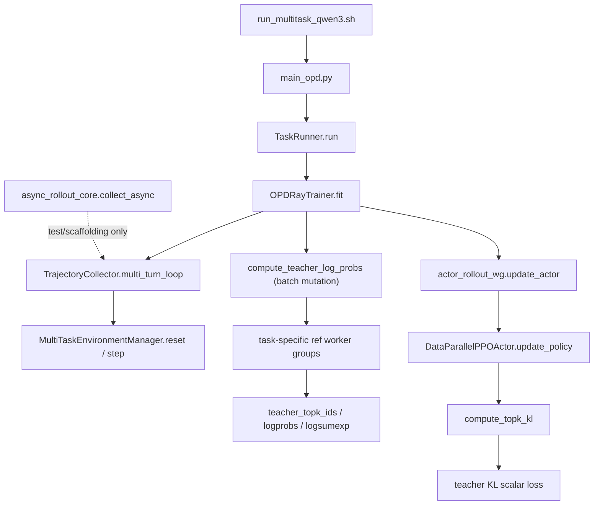

# Pure OPD call graph

Pure OPD production pathを中心にした実効call graph。破線相当の「実験」は固定sourceでproduction接続が確認できない経路。

Pure OPD thin loopは通常PPOのcritic value、advantage/returns、reward-KL、policy-gradient phaseを通らない。`compute_teacher_log_probs`はTensorを返すAPIではなく、入力DataProtoへteacher signalをscatterする副作用境界である。
