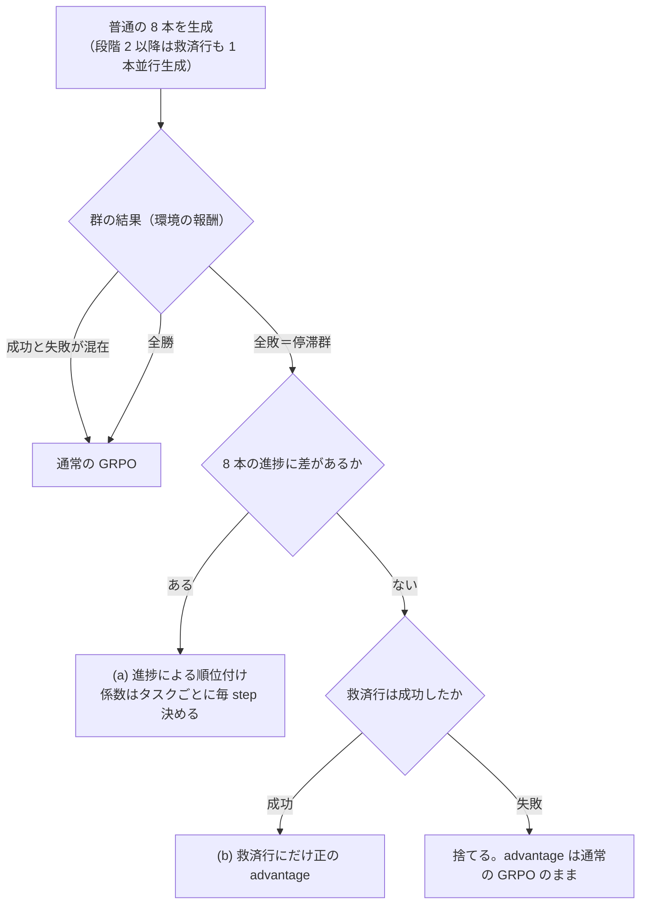

# 停滞群救済機構の提案

2026-09-17

改訂 2：(a) の係数をタスクごとに指数移動平均（EMA）で毎 step 決める形に変え、step 25 のマルチタスク測定を加えた。(a) はブランチ `claude/progress-rank-dynamic-c` に実装済み（未起動）。

改訂 3：step 25 で「形式混在」と数えた ALFWorld と WebShop の停滞群は、float32 の丸め誤差だった（数え直した値に差し替えた）。(a) は通常の advantage に足す形に決めた。群ごとの記録と、ProGPO の門と被覆を同じロールアウトで計算する影の指標を実装した。

## 背景と問題

本提案は、GRPO で学習信号が消える「停滞群」だけに、環境やデータが持つ正解を使って信号を与える。飽和群には手を入れない。

設定は Qwen3-1.7B、ALFWorld・WebShop・Search のマルチタスク OPD＋GRPO。プロンプト 1 つにつき 8 本を生成し、群内の成否の差から advantage を作る。損失は「PG（方策勾配）損失 ＋ 0.01 × 教師 KL」で、教師 KL は群の成否に関係なく全行にかかる。各タスクは損失の 1/3 を受け持つ（タスクごとのトークン数で正規化）。

- **縮退群**：8 本の結果がすべて同じ群。全敗を停滞群、全勝を飽和群、成否が混ざった群を live 群と呼ぶ。縮退群の advantage は、形式ペナルティ（無効な行動 1 手ごとに −0.1）による得点の差がなければ全行 0 になる。全手番が無効で全行が −0.1 の群では、float32 の丸めで |A| 0.0074 ほどが残るが、信号ではない
- **頻度**（3 タスクの floor 腕、群の割合）：ALFWorld は学習初期に停滞 70%、step 126 以降は停滞 14〜18%・飽和 51〜54%。WebShop も同じ形。Search は全期間で停滞 43〜51%
- **10 枠 run 1〜3**：停滞群に正解文書付きの救済行、飽和群に別目標の外来行を入れ、損失を整形・PPO clip・負の行の clip 反転と変えた。3 通りともエントロピーが上がり精度が落ちた（run 3 は step 71-80 で run 1 比 −10.7pt）。飽和群への失敗注入は情報を持たないと判断し、外す
- **特権尤度による順位付け**：walkthrough を見せた自分とタスク教師の尤度で縮退群を並べる案。step 150 の probe（60 群、採点経路の自己検査で差 0.0）で、どちらも普通の生徒を上回らず、最初の分岐点の正答率もチャンス以下だった。この線は閉じる

## マルチタスクで停滞群に起きていること（step 25 の測定）

**停滞したタスクの更新は、消えるのではなく「報酬駆動」から「教師駆動」に寄る。** 3 タスクの control（xt1）の step 25 で、損失の PG と教師 KL がどの群から来ているかを実際の損失計算から測った（1 タスク 70 群、n=8、T=1.0。付録 A）。停滞群は各タスクのトークンの半分以上を占め、教師 KL はそこにもかかるが、PG はほとんど運ばない。

| | ALFWorld | Search | WebShop |
| --- | --- | --- | --- |
| 停滞群がトークンに占める割合 | 56.7% | 62.0% | 50.6% |
| 停滞群が PG に占める割合 | 実質 0（1.3% は丸め誤差） | 32.7%（36 群中 2 群。残る 34 群はちょうど 0） | 実質 0（0.6% は丸め誤差） |
| 停滞群が教師 KL に占める割合 | 50.9% | 65.1% | 48.2% |
| 報酬駆動の信号を持つ群（live＋得点に差がある縮退群） | 33/70 | 10/70 | 38/70 |
| 学習の 15 群で、そのタスクに PG が全く無い step | ほぼ無し | 10 step に 1 回 | ほぼ無し |
| トークンあたり平均 \|A\|（全行） | 0.315 | 0.123 | 0.411 |
| advantage がちょうど 0 の行 | 1.4% | 86.1% | 18.3% |
| advantage が丸め誤差だけの行（全行の得点が同じ群） | 55.7% | 0% | 29.9% |
| 信号がある行だけの平均 \|A\|（トークン加重、丸めの行を除く） | 0.740 | 0.789 | 0.835 |
| 信号がある行がトークンに占める割合 | 42.0% | 15.6% | 49.0% |

- **3 タスクとも、弱さは強度ではなく被覆。** 信号がある行の \|A\| は 0.74〜0.84 で揃うが、その行がトークンに占める割合は ALFWorld 42%、WebShop 49%、Search 16%
- **ステップ内の信号の有無で重みを変えるのは逆効果。** 今の正規化では、信号群が少ない step ほどそのタスクの PG は小さくなり（縮小推定）、教師 KL は一定のまま。これを「群が揃っていたら」の大きさに引き直すと、Search の PG は平均 ×7.2、標準偏差 ×4.1 になり、信号 0 の step では定義もできない
- **押し下げと押し上げの PG 質量の比は 1.08 で釣り合っている**（ALFWorld 1.03、WebShop 1.05、Search 1.31）。10 枠 run の 12:1 と比べる基準になる
- **形式チャネルはまだ点灯していない。** \|A\| の最大は 4.99 で、5 を超える行は 30,720 行中 0。1 行だけ形式が正しい群に出る +19.9 は無い
- **前の版で「形式混在の停滞群」と数えた ALFWorld の 33 群と WebShop の 19 群は、丸め誤差だった。** 8 本の全手番が −0.1 を受けて得点が全行同じになり、群の平均を float32 で計算したときの丸めだけが \|A\| として残った（行ごとの記録で全行ちょうど 0.0074、300 行の群では 0.0147）。同じ GRPO の関数に全行 −0.1 の 400 行を通すと全行 0.0074 になり、有効な手番を 1 行混ぜると 0.05 と 19.9 になる。本当に得点の差があった停滞群は ALFWorld 0/33、WebShop 0/31、Search 2/36。この時期はほぼ全手番が無効扱いになる。enable_thinking=False のテンプレートが空の思考ブロックを先に閉じるので、モデルが自分で `<think>` を書くまで −0.1 が一律に付き、一律の −0.1 は advantage を動かさない（別の run では、有効な手番の割合が step 85〜120 ごろまで 0 だった）。群の分類は、\|A\| > 1e-12 ではなく行の得点の幅で判定するよう実装を直した

## 機構の概要

停滞群を「正解系列にどこまで沿えたか（進捗）」で 2 つに分け、差がある群は生成なしの順位付け、差がない群は正解系列を見せた救済行で救う。live 群と飽和群は今の GRPO のまま。



| 部品 | 対象 | 追加の生成 | 学習するトークン | 状態 |
| --- | --- | --- | --- | --- |
| (a) 進捗による順位付け | 進捗に差がある停滞群 | なし | 生徒が普段のプロンプトで生成したトークンだけ | 実装済み（段階 1） |
| (b) 進捗行付きの救済行 | 進捗に差がない停滞群 | 全群に 1 本（＋12.5%） | 救済行は文書付きプロンプトのまま（プロンプトをまたぐ確率比を挟まない） | 設計のみ（段階 2） |

**(a) の強さはタスクごとに違う。** 全タスクで共通なのは目標割合 ρ だけで、係数 c はそのタスク自身の通常の更新量から毎 step 決まる（次節）。(b) の生成量はタスク間で配分しない。

## (a) 進捗による順位付け

進捗に差がある停滞群では、正解系列により遠くまで沿えた失敗を押し上げ、進めなかった失敗を押し下げる。追加の生成もモデルの計算もいらない。行も足さないので、学習する行・トークン量・ミニバッチの正規化はすべて control と同じで、どの行も生成したプロンプトのまま学習する。10 枠 run でエントロピーを上げた経路（特殊な行の追加）を通らない。

**進捗 k の定義**：正解系列の手を何手実行したか（K は系列の手数）。環境マネージャが全行について毎手番数え、行の列として学習側に渡す。タスクごとの数え方は「タスクごとの正解系列と進捗」の表。

**停滞の判定は環境の報酬で行う。** GRPO が見る行の return は「エピソードの報酬 − 無効手番ごとの 0.1」で、軌跡の return をその最大値で取ると、全手番が無効だった失敗は −0.1、他の失敗は 0 になり、8 本とも失敗した群が live と判定される。こうした群も成功が 1 本も無いので、(a) では「どの軌跡も報酬を得ていない」群を停滞群とする（3 タスクとも失敗の報酬は 0）。

**差の判定**：8 本の k が全員同じでなく、かつ一番進んだ軌跡が min_top_k 以上なら「差がある」。WebShop は 2（1 手目の「目標商品が検索結果に出る」は偶然満たしやすい）。ALFWorld は到達点で数えるので 1（最初の到達点「目標の種類の物を取った」は偶然には満たしにくい。step 300 の look_at 型の失敗は 19 本中 17 本が k=1 で止まり、2 では一度も発火しない）。Search は 1 手しかないので 1。それ以外は (b) に回す。

**advantage**：

```
A(a)_i = c_task × (k_i − 群の k の平均) ÷ K
```

- 値は −c〜+c。**平均は GRPO の統計と同じ重みで取る**（この recipe では手番の行ごと＝手番数で重み付け）。そのため A(a) は、通常の advantage が合計 0 になるのと同じ行の上で合計 0 になり、群全体の押し下げを作らない
- 群の標準偏差では割らない。小さな差を大きな信号に増幅しないため
- 軌跡の全手番に同じ値を載せる（通常の GRPO と同じ）
- 通常の advantage（形式ペナルティ込み）はそのまま計算し、A(a) を後から足す。進捗を報酬に混ぜて一緒に正規化すると、縮退群の中でだけ効く形式ペナルティ（冗長化の歯止め）が埋もれる

### 足すか置き換えるか（決定：足す）

停滞群では環境の報酬が全員 0 なので、advantage が 0 でなくなるのは、形式ペナルティで行の得点に差があるとき（有効な手番と無効な手番が混ざっているとき）だけ。「置き換える」には 2 通りあり、どちらも足す形に劣る。

- **停滞群すべてで置き換える**：形式ペナルティの信号が停滞群から消える。floor 腕 B'（3 タスク）では、全手番が無効な全敗群で 1 行だけタグを書いた行が +19.9 を受け（step 103〜111）、step 112〜119 でタグを書くように切り替わった。置き換えるとこの経路と冗長化の歯止めを失う恐れがある
- **得点に差がない群だけに入れる（ProGPO 型）**：切り替わり前は停滞群の全行が −0.1 で差がないので、足す形とほぼ同じ。切り替わり後は、無効な手番が 1 つでもある群が外れるので、ほとんど発火しない。手番ごとに独立と仮定した概算では、無効な手番が 1 つもない群の割合は次のとおり

| 有効な手番の割合 | ALFWorld（8×50 行） | WebShop（8×15 行） | Search（8×4 行） |
| --- | --- | --- | --- |
| 94%（別の run の切り替わり後） | ほぼ 0 | 0.06% | 14% |
| 99% | 2% | 30% | 72% |

ProGPO の門（基本の得点の絶対値がすべて 1e-3 未満）を文字どおりに使うと、切り替わり前も全行 −0.1 なので開かない。

**足す形で残る干渉は 1 つ。** (a) は GRPO の平均と標準偏差を計算した後に足すので、形式ペナルティの信号の大きさは変わらない（+19.9 は +19.9 のまま）。成否が混ざる live 群にも触らない。残るのは、先まで進んだ軌跡の中の無効な手番の行に (a) の押し上げが乗り、形式ペナルティの押し下げを一部打ち消すこと。1 トークンあたりの上限は E（step 25 の ALFWorld で 0.315）。無効な手番が少数なら押し下げは大きい（400 行中 16 行で −4.9、1 行で −19.9）ので打ち消しは数 %、群の 3 割ほどあると押し下げは −1.5 まで小さくなり、打ち消しは最大 2 割ほどになりうる。無効な手番の行と形式混在の群に乗った (a) の押し上げ/押し下げを毎 step 記録し、大きければ (a) を有効な手番の行だけに足す形に変える

### 係数 c の決め方（タスクごと、毎 step）

**(a) が足す量は、そのタスクの典型的な報酬駆動の更新の ρ 倍になるように、c を毎 step 決める。** c は注入する advantage の目盛りで、トークンあたり平均 \|A\| と同じ単位。固定値にしないのは、同じ割合を狙う c がタスク間で約 4 倍違い（step 25 で、停滞群の全トークンに大きさ 1 の score が載ると仮定した見積もり：Search 0.0099、ALFWorld 0.0278、WebShop 0.0406）、しかも学習中に動くため。

1 step の中で、タスクごとに順に：

1. 通常どおり advantage を計算する（形式ペナルティ込み）
2. そのタスクの実際の行（詰め物の複製を除く）の**全行**について、トークンあたり平均 \|A\| を測る：M（advantage が 0 の行も分母に入る）
3. **指数移動平均（EMA）を更新する**：E ← 0.8 E + 0.2 M。下限 0.01。E が未初期化のうちは (a) を止めておき、M > 0 の最初の step で初期化する
4. (a) が発火した軌跡の行の \|score\| × トークン数を足し、M と同じく**そのタスクの全トークン数**で割る：u（score = (k − 平均 k)/K。発火した軌跡の中での平均ではない）
5. c = ρ × E ÷ u
6. **上限**：c × max\|score\| が E を超えないところで止める（1 トークンに、そのタスクの典型的な \|A\| 以上を注がない）
7. A に足す

こうすると (a) が足すトークンあたり平均 \|A\| は c × u = ρ × E になる。normalize_loss_by_task は 1 step の中で同じタスクの行に同じ重みを付けるので、トークンあたり平均の比はそのまま損失の質量の比になる。

- **分母を M ではなく E にする理由**：15 群でも Search の M の step ごとの変動係数は 0.52 で、10 step に 1 回ちょうど 0 になる。M で割ると c が毎 step 数倍動き、しかも (a) が唯一の報酬信号であるべき step で c = 0 になる。E（10 step ほどの平均）なら変動係数は 0.17 まで下がり（step 間が独立とみなした見積もり）、M = 0 の step でも正のまま
- **u は平滑化しない**：c × u = ρ × E なので、u が振れても注入される質量は変わらない。u が極端に小さい step（1 群だけが 1 手の差で発火）に c が跳ねるのを止めるのが上限
- **M に (a) 自身を含めない**：足す前の advantage から測る。含めると目標が自分の出力を追いかける
- **ρ = 0 のとき advantage は control とビット単位で同じ**（同じテンソルをそのまま返す）。段階 1 はここから始める
- **E はチェックポイントと一緒に保存し、再開時に戻す**。戻さないと、再開した run は 1 step 分の更新量からやり直す
- **この尺度の帰結（行あたり）**：E は advantage が 0 の行も含めた平均なので、信号のある行の \|A\| よりずっと小さい。step 25 では Search の E が 0.123 に対し、信号がある行は 0.789。ALFWorld は 0.315 と 0.740、WebShop は 0.411 と 0.835（丸めの行を除いた値）。上限（κ = 1）により、1 トークンが (a) から受ける値は E 以下で、ALFWorld と WebShop では信号がある行の \|A\| の半分以下、Search ではおよそ 0.12 以下になる。また縮退群が増えるほど M と E が下がるので、(a) が足す質量 ρ × E も下がる。**停滞しているタスクほど、(a) が足す絶対量は小さい。**「典型的な更新の一定割合」を目標にした代償で、`capped` と `injected_mean_abs_adv` で実際の効き方を記録する
- 上限に当たる条件は c × max\|score\| > κ × E。下の目安の ALFWorld の c ≈ 0.38 は E ≈ 0.315 を超えるが、上限に当たるのは \|score\| が 0.83 を超える軌跡があるときだけ

**数値の目安**（step 25、ρ = 0.05）：c = ρ × 平均\|A\| ÷（発火トークン比 × 平均\|score\|）。発火率と平均\|score\| を見積もって入れると Search ≈ 0.10、ALFWorld ≈ 0.38、WebShop ≈ 0.41。見積もりの 2 項は実装が毎 step 正確に計算するので、ここで決める必要はない。

**記録する指標**（タスクごと、毎 step）：

- 係数：c、上限前の c と上限そのもの、上限に当たったか、E と M、注入した質量と E に対する割合（= ρ、上限時は下回る）、M に対する割合
- 群：全敗群の割合（q_fail）、発火した群と差がなかった群・下限未満・進捗を数えられない群の数、停滞群のうち得点に差がある群（形式混在）の数。形式の差は行の得点の幅で判定する（\|A\| で判定すると丸め誤差を数える）
- 押し下げ/押し上げ：(a) と通常の advantage のそれぞれ。(a) の分は、形式混在の群とそうでない群、無効な手番の行に分けても出す。形式混在の群に乗った割合は、ProGPO の非干渉（命題 4.3）の範囲の外に出た (a) の量にあたる
- 成功した軌跡のうち k = 0 の割合（K > 0 の軌跡だけ）。ProGPO の命題 4.1(ii)（成功は被覆 0 より上）に対応する
- **ProGPO の影**（適用しない）：ProGPO の門が開く群の割合（ProGPO 自身の q_fail）、被覆 P = (D − 1)/T で発火する停滞群の数、(a) と両方が発火した群の数とその中での k と P の順位の一致（同順位を平均順位で扱う Spearman）、ProGPO 自身が発火する群の数（門が開き、かつ P が変わる）、成功した軌跡のうち D = 1 の割合。D は軌跡が見た観測文字列の種類数（初期観測を含み、文字列は環境が出したとおりに比べる）、T は手数

**群ごとの記録**：指標は要約なので、後から別の問いに答えられない（これまで 2 回、probe を取り直した）。毎 step、群 1 つにつき 1 行を書き出す。軌跡ごとの k・K・D・手数・トークン数・報酬・無効な手番の数・(a) の score、群の得点の幅・ProGPO の門・通常の \|A\| の最大・(a) が注入した質量、タスクの c・上限前の c・上限・E。学習では `<default_local_dir>/progress_rank_groups/step<N>.jsonl`、probe では `<出力>.groups/b<n>.jsonl`。`scripts/report_progress_groups.py` が読んで、上の対比をタスクごとに出す。

**実装**（ブランチ `claude/progress-rank-dynamic-c`。スイッチを切ると環境マネージャは何も書かず、バッチの列は control と同じ）：

| 場所 | 内容 |
| --- | --- |
| `agent_system/environments/progress.py` | 3 タスクの k と K の数え方。ProGPO の被覆 D（影。順位には使わない） |
| `agent_system/environments/env_manager.py` | 3 つの環境マネージャが全行の k, K, D を info に書く |
| `agent_system/multi_turn_rollout/rollout_loop.py` | 行ごとに `progress_k` / `progress_total` / `coverage_d` 列として記録 |
| `verl/trainer/ppo/progress_rank.py` | 停滞の判定、順位、EMA、c、上限、指標、形式の差の判定（得点の幅）、ProGPO の門と被覆の影、群ごとの記録 |
| `verl/trainer/ppo/opd_grpo_ray_trainer.py` | advantage 計算の直後に適用し、群ごとの記録を書き出す（書き込みの失敗は警告と指標にして学習は止めない）。OCI の腕との同時使用・列の欠落・grpo 以外の推定器を拒否 |
| `verl/trainer/ppo/opd_ray_trainer.py` | EMA をチェックポイントに保存・復元（GRPO 腕は目的関数の hook しか上書きしない決まりなので、共通の OPD trainer 側に置く）。probe では (a) の指標をバッチごとに payload に残す |
| `verl/trainer/ppo/term_mass.py` | 損失の内訳 probe の群クラスを、行の得点の幅で判定する（以前は \|A\| > 1e-12 で、丸め誤差を形式混在と数えていた） |
| `verl/trainer/config/ppo_trainer.yaml` | `algorithm.progress_rank`（enable、rho、ema_alpha 0.2、ema_floor 0.01、cap_kappa 1.0、min_top_k（ALFWorld 1・WebShop 2・Search 1）、alfworld_k（既定 milestone）、record_groups、record_dir） |
| `examples/opd_grpo_trainer/expected_multitask_progress_rank_config.yaml` | (a) の腕の設定の門番。control の固定値に `algorithm.progress_rank.*` と `test_freq=-1` を加えたもの。ρ の打ち間違いで起動が止まることを確認済み |
| `verl/trainer/ppo/progress_probe.py`、`examples/opd_grpo_trainer/run_multitask_progress_probe_qwen3.sh` | k と報酬の関係を測る probe（更新なし）。軌跡の記録に D と無効な手番の数を載せる。RHO を渡すと、その ρ での c と上限も記録する |
| `scripts/report_progress_groups.py` | 群ごとの記録から、(a) と ProGPO の門・被覆の対比、上限の効き方、形式混在の群に乗った (a) の割合をタスクごとに出す |
| `examples/opd_grpo_trainer/run_multitask_progress_rank_qwen3.sh` | xt1 の recipe に (a) だけを足す起動スクリプト（未起動） |
| `tests/oci/test_progress_rank.py` ほか 4 本 | 69＋73＋19＋19＋26 項目。ρ=0 の同一性、合計 0、EMA、上限、詰め物、実際の GRPO 関数の上での加算、ALFWorld の到達点の数え方、全行 −0.1 の群を得点の幅で一様と判定すること、ProGPO の門と被覆、群ごとの記録の中身と書き出し先。`sdar-multitask` 環境の python で実行する |

## (b) 進捗行付きの救済行

進捗に差がない停滞群には、正解系列と進捗行を見せて生成した救済行を 1 本使う。段階 2 で実装する。

| 項目 | 決定 |
| --- | --- |
| 見せる文書 | 正解系列の全手（番号付き）＋行動の直前に「次に実行すべき手は k 番目」と示す進捗行。進捗行はその手を実際に実行したときだけ進む |
| 生成のタイミング | 全群について、普通の 8 本と並行して 1 本生成する（ロールアウト +12.5%）。使わなかった分は捨てる |
| 群への入れ方（決定 ②） | **普通の 8 本の advantage は変えない。** 救済行が成功したら、救済行にだけ固定の正の advantage を載せる。その値は (a) の ρ とは別の設定名にする |
| ミニバッチの正規化 | 学習に使う行の本数で行う |
| 救済行も失敗したとき | 捨てる |
| 学習のさせ方 | 文書付きプロンプトのまま学習する。生成と学習のプロンプトが同じなので、普段のプロンプトとの間の確率比は挟まない（PPO の比は通常の行と同じ扱い） |
| 停止基準 | 最初の 30 step でエントロピーが同じゲームの control の 2 倍を超えたら止める |

- 失敗 1 本と入れ替えて GRPO にかける元の案は採らない。10 枠 run では、救済した停滞群 1 つごとに失敗 7 本へ計 −37.4、救済行へ計 +37.4 が載り、普段のプロンプトの側には押し下げだけが入った。救済行の return 10 で群の標準偏差が 1.1〜1.6 になり、群で 1 行だけ形式が正しかった行の +19.9 が 0.06 まで薄まった
- 普段のプロンプトに戻して確率比で補正する方式は採らない。run 1〜3 でエントロピーを上げた原因に近く、Scaf-GRPO の比較でも文書付きのままの学習に劣った（平均 47.3 対 50.9）
- **Search の文書**：答えは「結果に答えが返るまで、思考にも検索語にも答えにも書いてはいけない」という規則の文の中に平文で 1 回だけ書く。タグ付きの行動としては書かない（写すだけで成功できるため）。規則を破った救済行は捨てる。救済率は、どの文書でも停滞群の 10〜14% で頭打ちだった（ALFWorld の 88〜95% と対照的）

## タスクごとの正解系列と進捗

3 タスクとも、正解系列はモデルに生成させず、環境かデータセットが持つ正解から作る。

| タスク | 正解系列 | (a) の進捗 k の数え方 | 正解系列の質 | 注意 |
| --- | --- | --- | --- | --- |
| ALFWorld | タスクの型ごとの到達点（traj_data.json の型と対象）。(b) の文書は TextWorld の walkthrough | **到達点で数える**：目標の種類の物を取った・処理した（clean/heat/cool）・目標の種類の置き場に置いた（pick_two は 2 個）を、物の番号を問わず順不同で、環境が実行した行動から数え、環境が成功と判定したら K（K = 2〜4）。walkthrough の手と完全一致させる数え方も同じロールアウトで記録する（比較用） | walkthrough は全訓練ゲームで再生し 3553/3553 で成功。到達点は 6 型 × 10 ゲームの再生で 60/60 が K | walkthrough の数え方は、成功した軌跡の 68%（step 75）・70%（step 300）を K 未満と数えた。cabinet 2 に直行して 7 手で成功した軌跡も k=0。これを受けて到達点に替えた |
| WebShop | 商品名で検索 → 目標商品を開く → 必要なオプションを選ぶ → 購入（3〜6 手） | ① 検索結果のページに目標商品が出た ② 目標商品を開いた ③ 目標商品の上で必要なオプションを選んだ数（1 回の訪問での最大） ④ 目標商品を購入した。クリックは、その時点のページに実際にあったときだけ数える（環境と同じ判定）。検索し直す・戻ると選んだオプションは消える | 学習目標 200 件中 188 件で報酬 1.0 | 同じオプション名の値を選び直すと 1 つ多く数える。約 6% の目標は正解系列でも 1.0 に届かない |
| Search | (a)：なし（1 手）。(b)：質問そのままの検索、または検証済みの検索ルート | 返ってきた検索結果に答えが含まれたか（0/1）。数値だけの答えは、質問の内容語が同じ段落にあるときだけ数える | — | yes/no 問題は数えない（"yes" はほぼどの段落にもある）。live 群で勝敗を当てる度合いは AUC 0.65（HotpotQA 0.67、NQ 0.60）で、ALFWorld の 0.80 より弱い |

- **Search の (a) は注釈を使わない。** 以前の案（根拠記事・段落を何本引けたか）では NQ が 0/1 しか取らず発火しなかった。いまの定義では停滞群の約 4 割で行ごとに差があり、NQ も含む
- **Search で答えを書かせない理由**：Search の環境は途中の手の実行を強制しない。報酬は最後の答えの文字列しか見ないので、答えが書いてあれば写すだけで成功できてしまう。ALFWorld と WebShop は環境が手順を強制する

## 設計の根拠となる実測データ

進捗行と規則による進捗は ALFWorld で強い信号を示し、特権尤度は普通の生徒を上回らなかった。マルチタスクの測定は、係数をタスクごとに決める必要を示した。

| 測ったもの | 結果 | 設計への反映 |
| --- | --- | --- |
| 停滞群が損失に占める割合（xt1 step 25、付録 A） | トークンの 51〜62% を占め、PG は ALFWorld と WebShop で実質 0（1.3%・0.6% は丸め誤差）、Search は 36 群中 34 群が 0 | 停滞群に報酬駆動の信号を入れる価値がある |
| 停滞群の中の形式の差（同上、行ごとの記録） | ALFWorld の 33 群と WebShop の 19 群は全行の得点が同じで、\|A\| は丸め誤差（0.0074・0.0147）。得点に差があったのは Search の 2 群だけ | 形式の差は得点の幅で判定する。(a) は足す形にする |
| タスクごとの通常の \|A\| とその揺れ（同上） | トークンあたり平均 \|A\| が 0.12〜0.41 で 3.3 倍違う。Search の step ごとの PG は変動係数 0.52（15 群換算）、10 step に 1 回 0 | c をタスクごとに、EMA を分母にして決める |
| 押し下げ/押し上げの質量（同上） | 1.08（10 枠 run は 12:1） | (a) の押し下げ/押し上げをこれと比べて記録する |
| walkthrough を見せた救済行の成功率（floor 腕 step 25、停滞群） | 全体だけ：35%（12/34）。進捗行付き：同じゲームで 95%（36/38）、全 13 バッチで 88%（97/110） | (b) の文書に進捗行を必須にする |
| 進捗行なしで生徒が従った手数 | 6〜7 手中、最初の 1.5〜2.8 手。その後は自分の探索に戻る | 失敗の原因は「読まない」ではなく「位置を見失う」 |
| 規則による進捗と勝敗（ALFWorld、control step 150、live 28 群） | 群内 AUC 0.80。成功の平均進捗 0.61、失敗 0.15 | (a) の順位に進捗を使う |
| k と成功率（xt1 step 75・300、1 タスク 70 群、学習と同じ定義） | ALFWorld（walkthrough）：k=0 で 42%・58%、k=K で 100%、途中は 58〜94%。WebShop：k=K だけが 89〜90%、K 未満は 0〜30%（段差）。Search：k=0 で 5〜6%、k=1 で 63〜64% | 3 タスクとも k とともに成功率が上がる。WebShop と Search は段差に近く、失敗の中の順位の妥当性は成功率からは判定できない |
| 成功を K 未満と数えた割合（同上） | ALFWorld の walkthrough 68〜70%、WebShop 6〜7%、Search 4% | ALFWorld だけ到達点の数え方に替える |
| 2 つの数え方の比較（ALFWorld、step 300、同じ 560 軌跡） | 失敗 108 本のうち k>0 は walkthrough 18%・到達点 40%。live 群の失敗と停滞群の平均 k/K は walkthrough 0.09 と 0.03、到達点 0.30 と 0.13 | 到達点のほうが失敗の間に差を付け、解ける問題の失敗を先に置く |
| (a) が発火する停滞群（step 75 → 300） | ALFWorld 14 群中 1 → 8 群中 1〜2、WebShop 14 中 5 → 12 中 2、Search 35 中 4 → 32 中 4 | 停滞群の大半は全員の k が同じ。学習の 1 step あたり発火は各タスク 0〜1 群 |
| 成功軌跡が walkthrough を最後までなぞった割合 | live 群 41%、飽和群 32% | 別経路の成功が多い。(a) は小さな割合（ρ）で使う |
| 停滞群内の進捗の差（ALFWorld step 150、8 群） | 差あり 5（最大 2 手以上は 4）、全員 0 が 3 | 差のない群のために (b) が要る |
| Search の救済行 | 文書の種類を変えても停滞群の 10〜14% で頭打ち | Search での (b) の効き幅は小さい（未決事項） |
| 特権尤度の採点（control step 150、60 群） | 手番数補正後 AUC：普通 0.646、walkthrough 付き 0.635、教師 0.600 | 確率比による順位付けは採らない |

## 先行研究との関係と新規性

**(a) は、発動条件・差のない群を外す門・非干渉の主張・適応的な係数まで ProGPO にある。** 同じ ALFWorld と WebShop で、同じ規模のモデルで改善も出ている。残る差は「進捗を正解系列で測る」「係数の決め方」「3 タスク同時学習」の 3 つで、1 つ目は特権情報を要する分だけ弱い。

**ProGPO（本文で確認）**

- 全敗群だけで、初めて訪れた観測の割合 P で軌跡を順位付けする。advantage は λ(P_i − P̄)/(σ_P + ε) で、既存の advantage を**置き換える**。報酬の分散があるか全勝の群は通常の推定器のまま（命題 4.3 の非干渉：変わるのは基本の勾配がちょうど 0 の群だけ）。進捗の分散が閾値未満の群は 0 にする（こちらの `no_difference` と同じ役割）
- 実装（付録の Algorithm 2）では「基本推定器の得点の絶対値が群内すべて 1e-3 未満」で全敗を判定し、q_fail もこの判定で数える。進捗は P = (D − 1)/T（D は軌跡が見た観測文字列の種類数、T は実行した手数）で、群内の母標準偏差が 1e-4 未満なら 0。手番ごとに −0.1 の形式ペナルティがあるこの recipe に文字どおり移すと、全手番が無効な時期には門が開かず、切り替わり後も無効な手番が 1 つもない群でしか開かない。形式ペナルティの報酬を持つ群には触れないので、向こうには (a) の押し上げが形式ペナルティを打ち消すという干渉が無い
- **ProGPO との対比は同じロールアウトで測れるようにした。** 環境マネージャが D を数え、学習側が門・被覆による発火・k との順位の一致を適用せずに計算し、群ごとの記録に残す（「記録する指標」）
- λ_aux = 0.3 を全環境・全規模でタスク調整なしに固定し、実際の係数は λ_eff = λ_aux × q_fail（バッチ内で全敗の群の割合）で update ごとに変わる。**全敗が多いほど大きくなる**。こちらの ρ × E は、停滞群が増えるほど小さくなる
- 本文の「require no sweep」は閾値 τ_R・τ_P についての記述で、λ ではない。ALFWorld での λ_aux の掃引は 0.1: 94.5%、0.3: 92.2%、0.5: 78.3%、0.7: 83.6% で、**係数の値で成功率が 16pt 動く**。固定値が他の環境でも通用することは示しているが、複数タスクを 1 つの損失で同時に学習する設定は評価していない
- 結果（1.5B）：ALFWorld で GRPO 72.8→74.5、GiGPO 86.7→91.4、HGPO 92.8→95.7。WebShop 成功率で 56.8→60.9、65.0→72.4、71.5→75.7。7B でも同様

| 研究 | やっていること | 本提案との違い |
| --- | --- | --- |
| [ProGPO](https://arxiv.org/abs/2607.22724) | 上記 | 進捗を探索の広さで測る（特権情報不要）。群内の標準偏差で割る。置き換える。係数は全タスク共通で全敗の割合に比例 |
| [RL-ZVP](https://arxiv.org/abs/2509.21880)（ICLR 2026） | 零分散のプロンプトに生成なしで信号を入れる。全敗なら全応答の全トークンを −α(max H − H_t) で押し下げ（エントロピーの高いトークンほど弱く）、全勝なら +αH_t で押し上げる。数学の単発タスク | 全敗群の中で順位を付けない（群全体の押し下げで、合計 0 ではない）。10 枠 run で精度を落とした押し下げの形に近い |
| [SC-GRPO](https://arxiv.org/abs/2606.18810) | 全敗群の系列スコアを z 化し ×0.1 で advantage にする。生成なし | 構造は (a) と同じ。スコアは成否ではなく新規性（KL） |
| [BEACON](https://arxiv.org/abs/2605.06078) | 環境の応答から検出するマイルストーンで、同じマイルストーンに達した軌跡同士の区間ごとの advantage を足す。ALFWorld（1.5B）91.4%（GRPO 72.8%、GiGPO 86.1%） | 状態ベースの進捗の既報。差には区間ごとの推定器の効果も含まれる。ALFWorld の到達点の数え方の裏付け |
| [DAPO](https://arxiv.org/abs/2503.14476)、[NGRPO](https://arxiv.org/abs/2509.18851) | 零分散のプロンプトを再サンプリングで捨てる／仮想の報酬サンプルを足す | 前者は再正規化の対照、後者は以前の B' 案と同じ発想 |
| [XRPO](https://arxiv.org/abs/2510.06672)、[Scaf-GRPO](https://arxiv.org/abs/2510.19807)、[ActGuide-RL](https://arxiv.org/abs/2605.12004)、[Agent-G²](https://arxiv.org/abs/2608.23318) | 事例・ヒント・計画・専門家軌跡の先頭で、解けない群を成否の混ざった群に変える | (b) の直接の競合。行動直前の進捗行はない |
| [SPA-RL](https://arxiv.org/abs/2505.20732)、[iStar](https://arxiv.org/abs/2509.19199)、[AgentPRM](https://arxiv.org/abs/2511.08325)、[ProgRM](https://arxiv.org/abs/2505.18121) | 学習した進捗推定器・過程報酬モデルで手ごとの信用を作る | 学習した推定器を使う。本提案は環境とデータの正解から規則で数える |
| [IGPO](https://arxiv.org/abs/2510.14967)、[TSPO](https://arxiv.org/abs/2601.22776) | 検索エージェントで情報利得を報酬にする／マルチターン検索に部分報酬を入れる | Search の (a) と被る |
| RIDE（Raileanu & Rocktäschel, ICLR 2020） | 状態を大きく変える行動に内発報酬 | ProGPO の進捗の源流 |
| [PAC](https://arxiv.org/abs/2608.30528) | タスクごとの学習可能性を「step ごとの平均 \|A\| の履歴窓平均」で測り、報酬の伸びと合わせて Thompson Sampling でロールアウトをタスク間に配分する。単発の推論タスク | **タスク自身の平均 \|A\| の移動平均をそのタスクの尺度にする点は、こちらの E と同じ統計量。** 違いは、配分するのがロールアウト数で係数ではないこと、全敗群を扱わないこと |
| [AgentRL](https://arxiv.org/abs/2510.04206)、[MT-GRPO](https://arxiv.org/abs/2602.05547) | マルチターン・マルチタスクの同時学習とタスク内の advantage 正規化／タスクによって advantage 0 の頻度が違うという指摘 | 全敗群の信用付けは扱わない |
| [NuRL](https://arxiv.org/abs/2509.25666) | 正解そのものを見せると汎化を損なうと報告 | Search の文書で答えを行動として書かない根拠 |

調べた範囲で残る差（どれも単独では弱い）：

- **複数タスクを 1 つの損失で学習するとき、全敗群への信用の強さを各タスク自身の尺度で決めること。** 固定係数では同じ割合を狙う値がタスク間で 4 倍違うことを測定した。ただし ProGPO は固定係数が 2 環境で通用すると示しており、PAC は同じ統計量を別の目的（ロールアウト配分）に使っている。**固定係数との比較で差が出て初めて主張になる**
- **停滞したタスクの更新が教師駆動に寄ることの測定**（OPD＋GRPO で、群クラス別・PG と KL 別に実際の損失から）
- 行動の直前に次の手を示す進捗行と、進捗の差の有無で (a) と (b) を切り替えること
- 3 つの性質の違うエージェントタスクで、環境とデータの正解から正解系列と進捗を作ること。ProGPO の進捗が特権情報を要しないのに対し、こちらは要する
- 手番ごとの形式ペナルティがある multi-turn の報酬では、ProGPO の非干渉の門がほとんど開かないこと（概算。probe で確かめる）

## 実験計画と評価手順

**(a) だけを 3 タスクの control（xt1）の recipe に足して効果を確かめ、その後に (b) を足す。** 以前の計画では段階 1 を ALFWorld 単独にしていたが、(a) の係数をタスク別に決める部分がマルチタスクでしか意味を持たないので、3 タスクで始める。**xt1 は対になる control ではない。** xt1 は ALFWorld のゲーム順を揃えた修正（5a62ed9、9/14）より前の run で、ゲーム順がこのブランチと揃わない。control は同じコミットで取り直す。その分、費用は 3 タスク 150 step の run が 2 本になる。係数の決め方の比較（段階 1b の②③）を入れると 4 本。

| 段階 | 内容 | 比較相手 | 見るもの |
| --- | --- | --- | --- |
| 0（完了） | GPU なしの確認（Search の注釈フロー、付録 B）、Search の救済行 probe、xt1 step 25 の損失の内訳（付録 A） | — | 対象になる群の割合、タスクごとの \|A\| |
| 0.5 | xt1 step 75・300 の進捗 probe を ρ = 0.05 で（更新なし、1 点約 30 分） | — | 群ごとの記録から：(a) と被覆の発火、両方が発火した群での順位の一致、ProGPO の門が開く割合、上限の効き方、形式混在の群と無効な手番の行に乗る (a) の割合、無効な手番の割合（切り替わりの有無） |
| 1a | 3 タスク、(a) のみ、ρ = 0、数 step | 単体テスト（ρ = 0 で advantage が同一） | 進捗の列が実際の構成で届くか、発火した群の数と割合がタスクごとに妥当か |
| 1b | 3 タスク、(a) のみ、step 150 まで。係数の決め方だけを変えた 3 腕：① ρ = 0.05 のタスク別 EMA（本提案） ② 全タスク共通の固定 c ③ ProGPO の規則（群内の標準偏差で割る、λ_aux × 全敗割合、報酬がすべて 0 の群だけ置き換え）。②③は未実装。③は門を文字どおりに移すと ALFWorld と WebShop でほとんど発火しない見込みなので、段階 0.5 で門の開く割合を見てから入れるか決める | 同じコミットで取り直した control（150 step）。xt1 はゲーム順が揃わないので使わない | 成功率の推移、エントロピー、512 トークン打ち切り率、(a) の押し下げ/押し上げ、上限に当たる頻度。step 150 で各腕に損失の内訳の probe を回し、(a) の割合を直接読む。**①が②③を上回らなければ、係数の決め方は新規性にならない** |
| 2 | 3 タスク、(a)＋(b)（決定 ②） | 段階 1b と control | 救済率、差のない停滞群の頻度、上記の指標 |
| 3 | 単独タスク対 3 タスク × (a) の有無 | — | マルチタスクでの効果が単独と違うか（段階 1 の結果を見て決める） |

**評価の手順**

- 学習中の検証は切る（test\_freq=-1）。検証がチェックポイント保存より先に走るため、検証の失敗で学習済みの step が失われる
- 別ジョブで、加速を切った決定的な評価を 25〜50 step ごとに行い、推移で比べる。ALFWorld 単独の baseline は step 250 で最高、300 で急落したので、一時点だけの比較はしない
- 停止基準：最初の 30 step でエントロピーが control の 2 倍を超えたら止める
- 段階 1b で (a) が押し下げた ALFWorld の軌跡を数十本読み、別の正しい手順で進んでいた例の多さを数える（リスク 2）

## リスクと未決事項

**最大のリスクは、(a) の押し上げが、無効な手番の行で形式ペナルティの押し下げを一部打ち消すこと。** 形式ペナルティは冗長化の歯止めで、10 枠 run ではこれが効かなくなって崩れた一因だった。

**リスク**

1. **(a) の押し上げが、無効な手番の行で形式ペナルティの押し下げを一部打ち消す。** (a) は GRPO の平均と標準偏差を計算した後に足すので、形式ペナルティの信号の大きさ自体は変わらない（10 枠 run で +19.9 を 0.06 に縮めたのは、報酬 10 の行を群に入れて標準偏差が変わったこと）。残るのは、先まで進んだ軌跡の中の無効な手番の行に (a) の押し上げが乗る分で、1 トークンあたり E 以下。無効な手番が群の少数なら押し下げ（400 行中 16 行で −4.9）に対して数 %、群の 3 割なら（−1.5）最大 2 割ほど。step 25 の ALFWorld と WebShop の停滞群には得点の差がなく、この干渉はまだ起きない。有効な手番が多数派になった後の step で効いてくる。無効な手番の行と形式混在の群に乗った (a) の押し上げ/押し下げ、エントロピー、打ち切り率を毎 step 記録して見る。大きければ (a) を有効な手番の行だけに足す
2. **進捗の数え方が、別の正しい手順を取りこぼす。** ALFWorld は、walkthrough との完全一致が成功の 7 割を K 未満と数えたので、状態（目標の種類の物を取った・処理した・置いた）で数える到達点に替えた。WebShop はゴール記録の特定の商品に縛られ、条件を満たす別の商品を買った成功の 6〜7% を K 未満と数える（残る）。段階 1b で (a) が押し下げた軌跡を読み、別の手順で進んでいた例の多さを数える
3. **Search の進捗は弱い信号。** live 群の AUC は 0.65（NQ 0.60）で ALFWorld の 0.80 より低い。ρ は全タスク共通なので、Search にも自分の更新量の同じ割合が入る
4. **EMA は通常の更新量に比例するので、形式チャネルが点灯して通常の \|A\| が大きくなると、(a) もそれに合わせて大きくなる。** 目標を「典型的な更新の ρ 倍」にした帰結で、上限も E に比例する。後の step で (a) の注入量の絶対値を記録して確かめる
5. **比較の公平さ**。これまでの 3 タスク対 ALFWorld 単独の比較は、レシピの違う 2 run だった。ALFWorld のゲーム順は 5a62ed9 より前のチェックアウトではホストごとに変わる。(a) の run と control は同じレシピ・同じゲーム順・同じコードの版で揃える
6. **(b) の文書付きプロンプトで学んだことが普段のプロンプトに移るか**。移るという報告は数学の Scaf-GRPO だけで、エージェントでは測っていない

**未決事項**

- **足すか置き換えるか**：決定済み。足す形にした（「足すか置き換えるか」の節）
- **段階 1b の比較腕③を入れるか**：ProGPO の門は、この recipe では切り替わり後もほとんど開かない見込み。段階 0.5 で門の開く割合を見て、ほぼ control と同じになるなら外す
- **段階 1b の比較腕②の固定 c の値**：ProGPO の掃引では係数で成功率が 16pt 動く。全タスク共通の値を 1 つ選ぶ根拠（ProGPO の 0.3 に相当する大きさか、step 25 で①が出す c の平均か）
- **ρ の値**：0.05 で始める。段階 1b の損失の内訳の probe で実際の割合を確かめて調整する
- **タスクごとの ρ**：live 群で毎 step 測れる進捗の当たり具合（AUC）でタスクごとに ρ を変えるか。Search の信号が弱いこと（リスク 3）への対処候補
- **Search の (b)**：救済率が 10〜14% と低いので、根拠を引けていたのに答えを誤った群に限るか、Search では (b) を使わないか
- **状態ベースの進捗への切り替え**：段階 1b で押し下げた軌跡を読んだ結果で決める（リスク 2）

## 付録 A：xt1 step 25 の損失の内訳

**停滞群は各タスクの教師 KL の半分前後を運び、PG は運ばない（Search の得点に差がある 2 群を除く。ALFWorld と WebShop の「形式混在」は丸め誤差）。**

- チェックポイント：`klwctl_step25`（xt1 control）。1 タスク 7 群 × 10 バッチ、n = 8、T = 1.0、学習と同じ検索器・上位 3 件。tamago の GPU 4 枚
- 測り方：actor が自分の順伝播と損失計算を行い、逆伝播と更新はせず、行ごとに \|PG 損失\| の和・教師 KL の和・行の重みを書き出す。学習側がそれを (タスク, 群クラス) ごとに集計する。advantage は学習と同じ経路で計算したもの
- 自己検査：actor の PG 質量と、学習側がバッチの advantage から計算し直した PG 質量の比が、10 バッチすべてで 1.0000000。actor から欠けた行は 0。詰め物の行（重み 0）212 行は除外
- 群クラスはこの節だけ、既存の分類（行の return の最大値による判定）を使っている。(a) の停滞の判定（環境の報酬）とは、全手番が無効だった失敗を含む群で食い違う
- 形式混在と全行 0 の区別は、この測定の時点では \|A\| > 1e-12 で判定していた。ALFWorld の 33 群と WebShop の 19 群は全行の得点が同じ群で、表の PG 比 1.3%・0.6% は丸め誤差（行ごとの記録で \|A\| がちょうど 0.0074 か 0.0147）。いまの実装は得点の幅で判定する

| タスク | クラス | 群 | トークン比 | PG 比 | KL 比 | PG/KL |
| --- | --- | --- | --- | --- | --- | --- |
| ALFWorld | live | 31 | 41.5% | 97.8% | 45.8% | 162 |
| ALFWorld | 停滞・全行 −0.1（旧分類で形式混在。PG は丸め誤差） | 33 | 56.7% | 1.3% | 50.9% | 1.91 |
| ALFWorld | 飽和 | 6 | 1.8% | 0.9% | 3.4% | — |
| Search | live | 8 | 10.3% | 67.3% | 10.0% | 624 |
| Search | 停滞・advantage 全行 0 | 34 | 56.7% | 0 | 59.8% | 0 |
| Search | 停滞・形式混在 | 2 | 5.3% | 32.7% | 5.3% | 573 |
| Search | 飽和・advantage 全行 0 | 26 | 27.7% | 0 | 24.9% | 0 |
| WebShop | live | 38 | 49.0% | 99.4% | 51.4% | 596 |
| WebShop | 停滞・advantage 全行 0 | 12 | 19.3% | 0 | 16.4% | 0 |
| WebShop | 停滞・全行 −0.1（旧分類で形式混在。PG は丸め誤差） | 19 | 31.4% | 0.6% | 31.8% | 5.88 |
| WebShop | 飽和 | 1 | 0.4% | 0 | 0.4% | 0 |

- 比はタスク内の割合。PG/KL はそのクラスの PG 質量 ÷ 教師 KL 質量（教師 KL の係数 0.01 込み）
- バッチ（7 群）ごとのばらつきは大きい。Search のタスク全体の PG/KL は 0〜257、停滞群の PG 比は 0〜100%。7 群のバッチで PG が 0 だった回数（10 回中 2 回）は、学習の 15 群に換算すると 10 step に 1 回になる（群の信号率 10/70 から計算）
- 押し下げ/押し上げ（質量）：ALFWorld 1.03（行数では 16,105 対 7,251 で、押し下げの行 1 本あたりが 2.28 倍重い）、WebShop 1.05、Search 1.31、全体 1.08
- 数値の出典（いずれも `~/grad_probe/mass_klwctl_step25.json` とその行ごとの記録、tamago）：クラス別の表とバッチ間のばらつきは `scripts/report_mass_probe.py`。押し下げ/押し上げ、\|A\| の最大と分布、トークンあたり平均 \|A\|（全行・0 でない行）、step ごとの変動係数（7 群・15 群換算・EMA）、信号の有無で引き直したときの平均と標準偏差の倍率、15 群での PG ゼロの頻度は `scripts/mass_probe_signs.py`

## 付録 B：Search 正解フローのデータ検証

この付録は (b) の文書を作れる質問の割合を調べたもので、(a) の Search の進捗（答えを含む結果が返ったか）は注釈を使わない。

Search-R1 の学習データから 300 問を抜き（seed 0、HotpotQA 156 問・NQ 144 問）、(1) データセットの注釈と結合できるか、(2) 根拠が検索器のコーパス wiki-18 にあるか、(3) 学習と同じ検索器・同じ上位 3 件でフローの検索が根拠を返すか、を確かめた。**注釈から文書を作れるのは HotpotQA 96/156（62%）、NQ 59/144（41%）**。

フローの検索語は、HotpotQA が根拠記事のタイトル 2 つ、NQ が根拠段落の記事タイトル＋質問。

| 段階 | HotpotQA | NQ |
| --- | --- | --- |
| 抽出 | 156 | 144 |
| 注釈と結合できた | 156 | 103（DPR が根拠段落を付けたのは NQ 学習データの 74%） |
| フローの検索で根拠が返る | 121（根拠記事が 2 本とも） | 72（根拠段落） |
| 根拠記事のタイトルが答えを含まない＝文書の対象 | 96 | 59 |

コーパスには NQ の根拠段落が 103/103、HotpotQA の根拠文が 335/382 あった。HotpotQA で根拠記事がすべてある質問は 131/156。

**検索器が返すもの（上位 3 件）**

| 検索語 → 見るもの | HotpotQA ブリッジ型（122） | HotpotQA 比較型（34） | NQ（結合できた 103） |
| --- | --- | --- | --- |
| 質問そのまま → 答えの文字列 | 52（43%） | 24/26（yes/no の 8 問を除く） | 81（79%） |
| 質問そのまま → 根拠段落 | — | — | 60（58%） |
| フローの検索 → 根拠 | 91（75%） | 30（88%） | 72（70%） |
| フローの検索 → 答えの文字列 | 102（84%） | 25/26 | 89（86%） |
| 根拠記事のタイトルが答えを含む | 32（26%） | 1 | 14（14%） |

**読み取れること**

- **フローが効くのはブリッジ型**。答えの文字列が上位 3 件に出る割合が、質問そのままの 43% からフローで 84% になる。比較型は 33/34 で根拠記事 2 本とも質問に名前が出ており、フローが新しく教えることは少ない
- **NQ は検索ではなく答え方で落ちている可能性がある**。質問そのままでも根拠段落が 58%、答えの文字列が 79% 返る
- **タイトルが答えを含む質問は文書から外す**。ブリッジ型の 26%、NQ の 14% で、タイトルを書くと答えを書くことになる

**測り方の注意**

- 答えの文字列は、正規化した単語列として文書に含まれれば数える。関係ない文脈に同じ語が出ても数えるので、上振れする
- 根拠段落・根拠文は、その単語の 80% 以上を含む文書が返れば「返った」とする。質問に名前が出ているかは、タイトル末尾の括弧（(film) など）を除いて判定した
- 途中で照合の不具合を 3 つ見つけて直し、300 問を検索し直した。① コーパスは 1 語のタイトル（Bacon など）を引用符なしで保存していた ② コーパスはアクセント付き文字を分解して保存し（Löw → o＋結合記号）、HotpotQA のタイトルには `Ben &amp; Jerry's` のような HTML エスケープが残っていた ③ 答えの一致が部分文字列だった（「5」が「1950」に一致）。NQ は DPR 側が質問を `boo 'd up` のように分かち書きしているので、正規化して結合した
- スクリプトと結果：`/opt1/ohara/data/qa_annotations/verify_search_flows.py`、`verify_300/summary.json`（検索結果の文書も保存済み）
