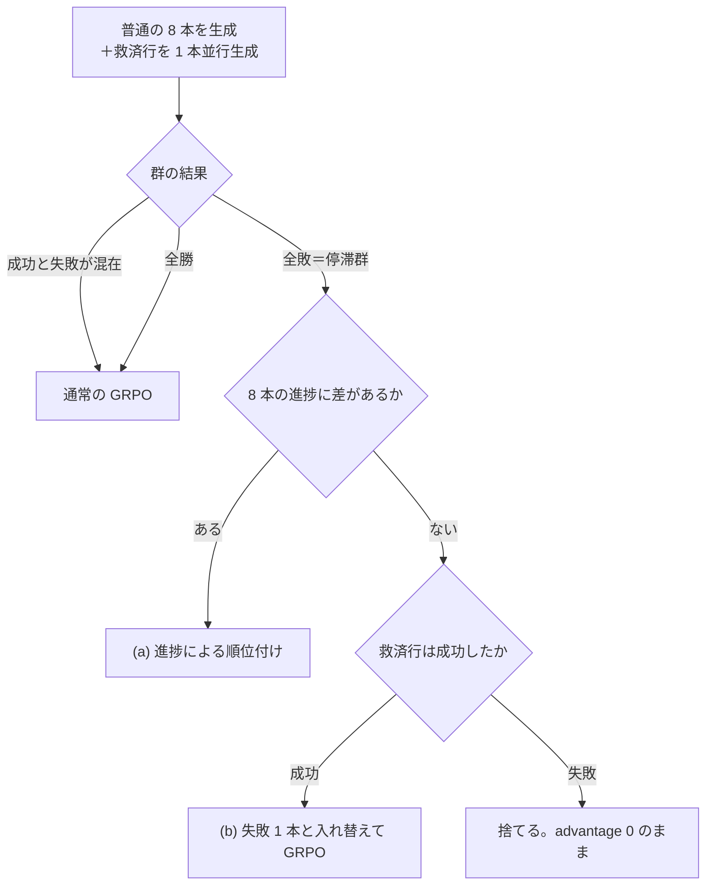

# 停滞群救済機構の提案

2026-09-17

## 背景と問題

本提案は、GRPO で学習信号が消える「停滞群」だけに、環境やデータが持つ正解を使って信号を与える。飽和群には手を入れない。

設定は Qwen3-1.7B、ALFWorld・WebShop・Search のマルチタスク OPD＋GRPO。プロンプト 1 つにつき 8 本を生成し、群内の成否の差から advantage を作る。

- **縮退群**：8 本の結果がすべて同じ群。advantage が全行 0 になり、報酬からの信号が出ない。全敗を停滞群、全勝を飽和群と呼ぶ
- **頻度**（3 タスクの floor 腕、群の割合）：ALFWorld は学習初期に停滞 70%、step 126 以降は停滞 14〜18%・飽和 51〜54%。WebShop も同じ形。Search は全期間で停滞 43〜51%
- **10 枠 run 1〜3**：停滞群に正解文書付きの救済行、飽和群に別目標の外来行を入れ、損失を整形・PPO clip・負の行の clip 反転と変えた。3 通りともエントロピーが上がり精度が落ちた（run 3 は step 71-80 で run 1 比 −10.7pt）。飽和群への失敗注入は情報を持たないと判断し、外す
- **特権尤度による順位付け**：walkthrough を見せた自分とタスク教師の尤度で縮退群を並べる案。step 150 の probe（60 群、採点経路の自己検査で差 0.0）で、どちらも普通の生徒を上回らず、最初の分岐点の正答率もチャンス以下だった

## 機構の概要

停滞群を「正解系列にどこまで沿えたか（進捗）」で 2 つに分け、差がある群は生成なしの順位付け、差がない群は正解系列を見せた救済行で救う。ライブ群と飽和群は今の GRPO のまま。

救済行は全群に並行して生成し、差のない停滞群でだけ使う。使わない救済行は捨てる。

| 部品 | 対象 | 追加の生成 | 学習するトークン |
| --- | --- | --- | --- |
| (a) 進捗による順位付け | 進捗に差がある停滞群 | なし | 生徒が普段のプロンプトで生成したトークンだけ |
| (b) 進捗行付きの救済行 | 進捗に差がない停滞群 | 全群に 1 本（＋12.5%） | 救済行は文書付きプロンプトのまま（比はちょうど 1） |

今回は、タスク間で救済の予算を配分するマルチタスク専用の調整は入れない。3 タスクに同じ規則を一様に適用する。

## (a) 進捗による順位付け

進捗に差がある停滞群では、正解系列により遠くまで沿えた失敗を押し上げ、進めなかった失敗を押し下げる。追加の生成もモデルの計算もいらない。

**進捗 k の定義**：正解系列の手を、順番どおりに何手実行したか。環境が実際に実行した行動が「次に必要な手」と一致したときだけ 1 進める。途中に関係ない行動をはさんでもよい。進捗行と同じポインタを普通の 8 本にも環境内で持たせ、エピソード終了時に返す。

**差の判定**：8 本の k が全員同じでなく、かつ一番進んだ軌跡が 2 手以上なら「差がある」。それ以外は (b) に回す。正解系列の 1 手目は「〇〇へ行く」が多く、探索中に偶然一致しやすいため。

**advantage**：

- A(a)\_i = c × (k\_i − 群の k の平均) ÷ 正解系列の手数。値は −c〜+c、群内の合計は 0
- 群の標準偏差では割らない。小さな差を大きな信号に増幅しないため
- c は 0.1 から始め、停滞群が損失に占める割合を記録して調整する
- 手番の扱いは通常の GRPO と同じ（軌跡の全手番に同じ値を載せる）

**形式ペナルティとの関係**：今の GRPO の advantage（−0.1 の形式ペナルティ込み）はそのまま計算し、A(a) を後から足す。進捗を報酬に混ぜて一緒に正規化すると、縮退群の中でだけ強く効く形式ペナルティ（冗長化の歯止め）が埋もれる。

## (b) 進捗行付きの救済行

進捗に差がない停滞群には、正解系列と進捗行を見せて生成した救済行を 1 本入れる。救済行は、生成したときと同じ文書付きのプロンプトのまま学習する。

| 項目 | 決定 |
| --- | --- |
| 見せる文書 | 正解系列の全手（番号付き）＋行動の直前に「次に実行すべき手は k 番目」と示す進捗行。進捗行はその手を実際に実行したときだけ進む |
| 生成のタイミング | 全群について、普通の 8 本と並行して 1 本生成する（ロールアウト +12.5%）。使わなかった分は捨てる |
| 群への入れ方 | 救済行が成功したら、失敗 1 本と入れ替えて 8 本のまま GRPO にかける。control と群の本数がそろう |
| 救済行も失敗したとき | 捨てる。群は advantage 0 のまま |
| 学習のさせ方 | 文書付きプロンプトのまま学習する。生成と学習の条件が同じなので確率比はちょうど 1 |

成功 1 本・失敗 7 本の群では、救済行が押し上げられ、7 本の失敗が一様に押し下げられる。統計を手番単位で取るので、短い救済行の各手に大きな正の値、長い失敗の各手に小さな負の値が載り、合計は 0 になる。

普段のプロンプトに戻して確率比で補正する方式は採らない。run 1〜3 でエントロピーを上げた原因に近く、Scaf-GRPO の比較でも文書付きのままの学習に劣った（平均 47.3 対 50.9）。

## タスクごとの正解系列と進捗

3 タスクとも、正解系列はモデルに生成させず、環境かデータセットが持つ正解から作る。

| タスク | 正解系列 | 進捗 k の数え方 | 正解系列の質 | 救済の対象外 |
| --- | --- | --- | --- | --- |
| ALFWorld | TextWorld の walkthrough（ゲームファイルに付属） | walkthrough の手と実行した行動の完全一致 | 全訓練ゲームで再生し 3553/3553 で成功 | なし |
| WebShop | 商品名で検索 → 目標商品を開く → 必要なオプションを選ぶ → 購入（3〜6 手） | ① 検索結果に目標商品の ID が出た ② 目標商品を開いた ③ オプション 1 つごとに +1 ④ 購入した。①は検索語が自由なので画面の状態で判定 | 学習目標 200 件中 188 件で報酬 1.0 | 正解系列でも 1.0 に届かない約 6% の目標（報酬計算のオプション照合の不具合） |
| Search | データセットの根拠注釈から作る検索のフロー。HotpotQA：根拠記事 1 を検索 → 根拠記事 2 を検索 → 答える。NQ：答えを含む段落を引く検索 → 答える。最後の答えは書かない | 根拠の記事・段落を何本引けたか（HotpotQA 0/1/2、NQ 0/1） | (b) の文書を作れるのは HotpotQA 62%、NQ 41%（300 問、付録） | 根拠注釈のない質問、フローの検索で根拠が返らない質問、根拠記事のタイトルが答えを含む質問（タイトルを書くと答えを書くことになる）。(a) は注釈があれば使える |

- **Search で答えを書かない理由**：Search の環境は途中の手の実行を強制しない。報酬は最後の答えの文字列しか見ないので、答えが書いてあれば写すだけで成功できてしまう
- **Search の注釈**：HotpotQA の学習データ 90,447 問は全問に人手の根拠文（supporting facts）がある。NQ 79,168 問のうち、DPR の学習データに答えを含む段落の ID があるのは約 5.9 万問（約 74%）
- **用意する量**：学習で引く Search の質問は 1 step 15 問 × 300 step = 4,500 問。データの順番は seed で決まるので、この分だけ事前に用意すればよい

## 設計の根拠となる実測データ

進捗行と規則による進捗は実測で強い信号を示し、特権尤度は普通の生徒を上回らなかった。いずれも ALFWorld での測定。

| 測ったもの | 結果 | 設計への反映 |
| --- | --- | --- |
| walkthrough を見せた救済行の成功率（floor 腕 step 25、停滞群） | 全体だけ：35%（12/34）。進捗行付き：同じゲームで 95%（36/38）、全 13 バッチで 88%（97/110） | (b) の文書に進捗行を必須にする |
| 進捗行なしで生徒が従った手数 | 6〜7 手中、最初の 1.5〜2.8 手。その後は自分の探索に戻る | 失敗の原因は「読まない」ではなく「位置を見失う」 |
| 規則による進捗と勝敗（control step 150、live 28 群） | 群内 AUC 0.80。成功の平均進捗 0.61、失敗 0.15 | (a) の順位に進捗を使う |
| 成功軌跡が walkthrough を最後までなぞった割合 | live 群 41%、飽和群 32% | 別経路の成功が多い。(a) は小さな係数で使う |
| 停滞群内の進捗の差（step 150、8 群） | 差あり 5（最大 2 手以上は 4）、全員 0 が 3 | 差のない群のために (b) が要る |
| 特権尤度の採点（control step 150、60 群、採点経路の差 0.0 を確認） | 手番数補正後 AUC：普通 0.646、walkthrough 付き 0.635、教師 0.600。最初の分岐点の正答率 0.39〜0.46（いずれも CI が 0.5 を含む） | 確率比による順位付けは採らない |
| 10 枠 run 1〜3（救済行＋外来行） | 3 通りの損失すべてでエントロピーが上昇。停滞群の救済行だけの run は未実施 | 外来行を外し、救済行は文書付きプロンプトで学習 |

## 先行研究との関係と新規性

「全敗のときに正解情報で誘導する」こと自体は既報が多い。新規性は、進捗行で救済率を上げる点と、進捗の差で (a) と (b) を振り分ける点にある。

| 研究 | やっていること | 本提案との違い |
| --- | --- | --- |
| [ActGuide-RL](https://arxiv.org/abs/2605.12004) | 解けないときだけ、行動データ由来の計画で誘導したロールアウトを混ぜる（検索エージェント） | 進捗行がない。進捗による順位付けがない |
| [Agent-G²](https://arxiv.org/abs/2608.23318) | ALFWorld・WebShop で専門家の軌跡の先頭を与えてからロールアウト。与える深さをガウス分布で選ぶ | 先頭を実行済みにする方式で、文書＋進捗行ではない。最も近い比較相手 |
| [Scaf-GRPO](https://arxiv.org/abs/2510.19807) | 全敗群に段階的なヒントで成功を 1 本作り、失敗と入れ替える。ヒント付きプロンプトのまま学習（数学） | 学習のさせ方は同じ。エージェントと進捗行はない |
| [CAPF](https://arxiv.org/abs/2606.01830) | 検索エージェントで、答えを伏せた検証器の指摘を受けて答え直し、指摘より前の信用を割り引く | 学習中に 30B モデルで指摘を生成。本提案はデータの注釈で事前に用意 |
| [E-GRPO](https://arxiv.org/abs/2510.24694)・[StepSearch](https://arxiv.org/abs/2505.15107) | 検索で失敗したロールアウトに正解エンティティや根拠文書で部分点を与える | Search の (a) はこれらに近い。本提案は停滞群の、差があるときだけに限る |
| [NuRL](https://arxiv.org/abs/2509.25666) | 正解そのものを見せると汎化を損なうと報告 | Search の文書に答えを書かない根拠 |

既報に見つからなかった点：行動の直前に次の手を示す進捗行。解くべき手順に対する進捗の差で、生成なしの順位付けと救済行を切り替えること。3 つの性質の違うエージェントタスクで、モデル生成ではなく環境とデータの正解から正解系列を作ること。

## 実験計画と評価手順

ALFWorld 単独で (a)、(a)＋(b) の順に効果を確かめてから、3 タスクに同じ規則を適用する。各段階の結果で次に進むか決める。

| 段階 | 内容 | 比較相手 | 見るもの | 計算量の目安 |
| --- | --- | --- | --- | --- |
| 0 | GPU なしの確認：Search の注釈フロー（完了、付録）、NQ の停滞群が検索で落ちているか、WebShop の進捗の差 | — | 救済の対象になる質問・目標の割合 | 数時間 |
| 1 | ALFWorld 単独、(a) のみ | ALFWorld 単独の control | 成功率の推移、エントロピー、512 トークン打ち切り率、停滞群の割合 | 150 step で約 19 時間（GPU 3 枚） |
| 2 | ALFWorld 単独、(a)＋(b) | 段階 1 と control | 救済率、差のない停滞群の頻度、上記の指標 | 同上＋ロールアウト 12.5% |
| 3 | 3 タスク、(a)＋(b) を一様に適用 | 3 タスクの control（xt1） | タスクごとの成功率と停滞群の割合 | 300 step で約 2 日以上 |

**評価の手順**

- 学習中の検証は切る（test\_freq=-1）。検証がチェックポイント保存より先に走るため、検証の失敗で学習済みの step が失われる
- 別ジョブで、加速を切った決定的な評価を 25〜50 step ごとに行い、推移で比べる。ALFWorld 単独の baseline は step 250 で最高、300 で急落したので、一時点だけの比較はしない
- 学習中に記録するもの：普通の 8 本で数えた停滞・飽和・live の割合、(a) と (b) の発火数、救済率、進捗の分布、停滞群が損失に占める割合

## リスクと未決事項

最大のリスクは (b) の群への入れ方だ。10 枠 run でエントロピーを上げた 2 つの経路のうち、確率比の係数は外したが、形式ペナルティが薄まる経路は今の設計にも残る。

**リスク**

1. **(b) の群では、普段のプロンプトの側に押し下げだけが入り、形式ペナルティの効きも消える**。10 枠 run では、救済した停滞群 1 つごとに失敗 7 本へ計 −37.4、救済行へ計 +37.4 が載った。救済行の return 10 で群の標準偏差が 1.1〜1.6 になり、群で 1 行だけ形式が正しかった行の +19.9 が 0.06 まで薄まった。形式が正しい手番（\<think> と \<action> を両方含む）の割合は、ALFWorld 単独の baseline では step 85〜95 に 0.94 まで上がったが、10 枠 run では step 140 ごろまで 0 のままだった。段階 2 でこの割合、エントロピー、512 トークン打ち切り率を control と比べる
2. **文書付きプロンプトで学んだことが普段のプロンプトに移るか**。普段のプロンプトには文書も進捗行もない。移るという報告は数学の Scaf-GRPO だけで、エージェントでは測っていない。段階 2 で、ALFWorld の 6 つのタスク種別ごとに停滞群の割合と成功率を control と比べる
3. **完全一致の進捗は、別の正しい手順を取りこぼす**。成功軌跡が walkthrough を最後までなぞったのは live 群 41%、飽和群 32% で、残りは walkthrough と違う手順で成功している。WebShop も目標商品以外に条件を満たす商品がありうる。c を小さく取り、段階 1 で (a) が押し下げた軌跡を数十本読む。別の手順で進んでいた例が多ければ、行動の一致ではなく状態（目標物を持った、加熱した、置いた）で数える方式に替える
4. **Search では進捗の上限が小さく、差の判定がそのままでは使えない**。NQ の進捗は 0 か 1 なので「一番進んだ軌跡が 2 手以上」を満たさず、(a) が発火しない。HotpotQA は、比較型（2 つの対象を比べる質問）の 33/34 で根拠記事 2 本とも質問に名前が出ている。ブリッジ型（1 本目の記事で見つけた対象を 2 本目で調べる質問）も 89/122 でどちらかの名前が出ている（付録の抽出 156 問）。名前で検索するだけで進む手が多い
5. **WebShop と Search で救済行が成功するかは未測定**。88〜95% は ALFWorld（floor 腕 step 25 の停滞群）での値。段階 3 の前に、GPU を使う小さな probe で測る（実行前に相談）
6. **タスク間の信号の偏り**。Search は全期間で停滞 43〜51% と多く、新たに信号を得る群の多くが Search になりうる。今回は配分を調整しないので、タスクごとに停滞群が損失に占める割合を記録し、偏りが大きければ配分の調整を再検討する
7. **比較の公平さ**。これまでの 3 タスク対 ALFWorld 単独の比較は、レシピの違う 2 run だった。ALFWorld のゲーム順は 5a62ed9 より前のチェックアウトではホストごとに変わる。提案 run と control は同じレシピ・同じゲーム順で揃え、満たさない control は取り直す

**未決事項**

- **(b) の群への入れ方**：決定どおり失敗 1 本と入れ替えて GRPO にかけるか、普通の 8 本の advantage は変えず救済行にだけ正の値を載せるか。後者は押し下げがなく、形式ペナルティも残る（リスク 1）
- **Search の差の判定**：NQ は「進捗 1 がいれば差あり」にするか、NQ の停滞群はすべて (b) に回すか。HotpotQA は質問に名前の出ていない記事を引けたときだけ数えるか（リスク 4）
- **c の値**：0.1 で始め、停滞群が損失に占める割合を見て調整する
- **中断中の step 50 の特権尤度 probe**：特権尤度による順位付けは採らないので、再開しないことを提案する

## 付録：Search 正解フローのデータ検証

Search-R1 の学習データから 300 問を抜き（seed 0、HotpotQA 156 問・NQ 144 問）、(1) データセットの注釈と結合できるか、(2) 根拠が検索器のコーパス wiki-18 にあるか、(3) 学習と同じ検索器・同じ上位 3 件でフローの検索が根拠を返すか、を確かめた。**(b) の文書を作れるのは HotpotQA 96/156（62%）、NQ 59/144（41%）**。

フローの検索語は、HotpotQA が根拠記事のタイトル 2 つ、NQ が根拠段落の記事タイトル＋質問。

| 段階 | HotpotQA | NQ |
| --- | --- | --- |
| 抽出 | 156 | 144 |
| 注釈と結合できた | 156 | 103（DPR が根拠段落を付けたのは NQ 学習データの 74%） |
| フローの検索で根拠が返る | 121（根拠記事が 2 本とも） | 72（根拠段落） |
| 根拠記事のタイトルが答えを含まない＝(b) の対象 | 96 | 59 |

コーパスには NQ の根拠段落が 103/103、HotpotQA の根拠文が 335/382 あった。HotpotQA で根拠記事がすべてある質問は 131/156。

**検索器が返すもの（上位 3 件）**

| 検索語 → 見るもの | HotpotQA ブリッジ型（122） | HotpotQA 比較型（34） | NQ（結合できた 103） |
| --- | --- | --- | --- |
| 質問そのまま → 答えの文字列 | 52（43%） | 24/26（yes/no の 8 問を除く） | 81（79%） |
| 質問そのまま → 根拠段落 | — | — | 60（58%） |
| フローの検索 → 根拠 | 91（75%） | 30（88%） | 72（70%） |
| フローの検索 → 答えの文字列 | 102（84%） | 25/26 | 89（86%） |
| 根拠記事のタイトルが答えを含む | 32（26%） | 1 | 14（14%） |

**読み取れること**

- **フローが効くのはブリッジ型**。答えの文字列が上位 3 件に出る割合が、質問そのままの 43% からフローで 84% になる。比較型は 33/34 で根拠記事 2 本とも質問に名前が出ており、フローが新しく教えることは少ない
- **NQ は検索ではなく答え方で落ちている可能性がある**。質問そのままでも根拠段落が 58%、答えの文字列が 79% 返る。停滞している NQ の群が、根拠を引いた上で答えの抜き出しや表記の一致で落ちているなら、(b) のフローは効かない。段階 0 で、既存 run の記録から停滞群の軌跡が根拠段落を引けていた割合を数える
- **タイトルが答えを含む質問は (b) から外す**。ブリッジ型の 26%、NQ の 14% で、タイトルを書くと答えを書くことになる。比較型は答えが質問に書いてあるので漏れに数えない。外した質問でも (a) は使える

**測り方の注意**

- 答えの文字列は、正規化した単語列として文書に含まれれば数える。関係ない文脈に同じ語が出ても数えるので、上振れする
- 根拠段落・根拠文は、その単語の 80% 以上を含む文書が返れば「返った」とする。質問に名前が出ているかは、タイトル末尾の括弧（(film) など）を除いて判定した
- 途中で照合の不具合を 3 つ見つけて直し、300 問を検索し直した。① コーパスは 1 語のタイトル（Bacon など）を引用符なしで保存していた ② コーパスはアクセント付き文字を分解して保存し（Löw → o＋結合記号）、HotpotQA のタイトルには `Ben &amp; Jerry's` のような HTML エスケープが残っていた ③ 答えの一致が部分文字列だった（「5」が「1950」に一致）。NQ は DPR 側が質問を `boo 'd up` のように分かち書きしているので、正規化して結合した
- スクリプトと結果：`/opt1/ohara/data/qa_annotations/verify_search_flows.py`、`verify_300/summary.json`（検索結果の文書も保存済み）
